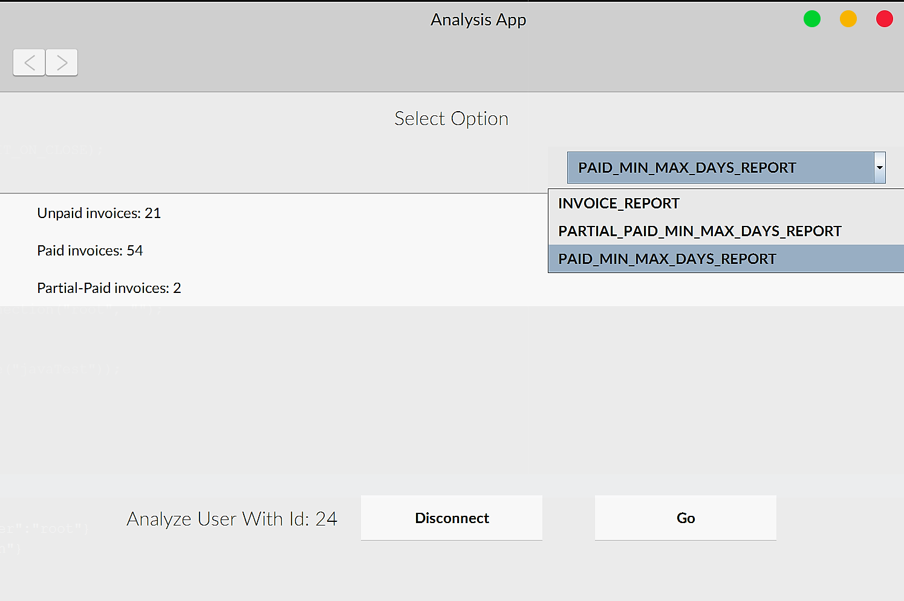

# DataAnalysisQuickbooksXero
This is a Desktop application Java based that analyze quickbooks and xero data stored in your database.

### How to use
just run Main.java file

# Sample Images

### Launch app layout
Here you can input you mysql details and connect to your database

### How many sessions or Download data have being commited
Gets info of all data session that have been processed during the usage of the HTML Web App

### Invoice per session
Gets all invoice from database per session

### Display Minimun and Maximun days
Gets all min max days of payments or invoice paids

